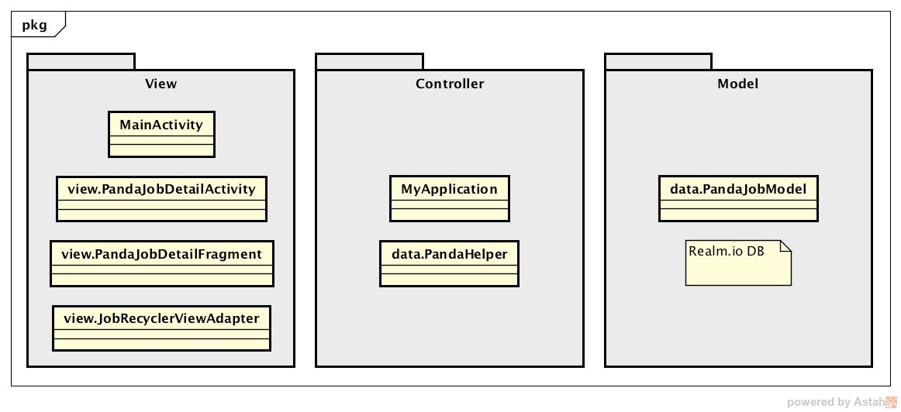
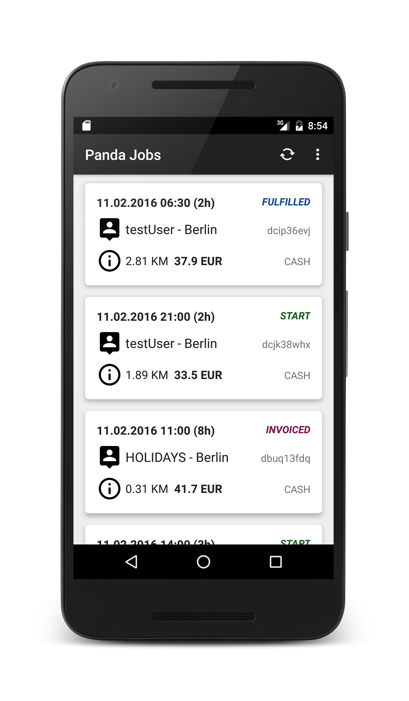
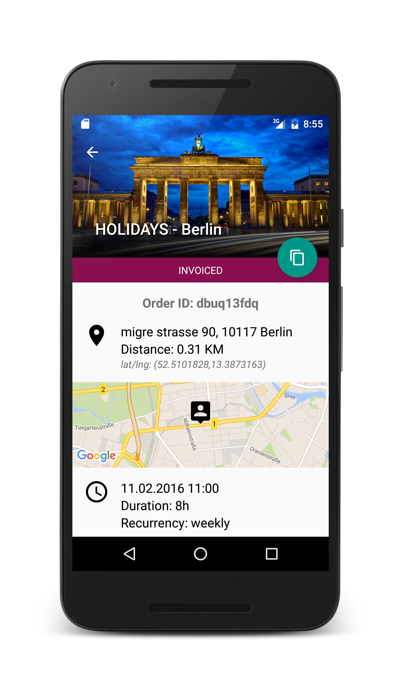
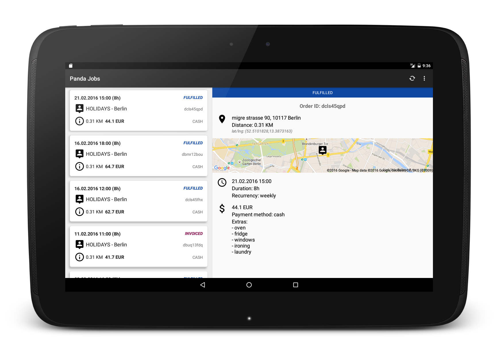

Panda Jobs

__Architecture Overview__

__Nexus 5 Screenshots__

__10" Tablet__

__Main technologies and resources__

Google Material Icons
https://design.google.com/icons/

* Ralm
   http://realm.io/
* Butterknife
   http://jakewharton.github.io/butterknife/
   https://github.com/codepath/android_guides/wiki/Reducing-View-Boilerplate-with-Butterknife
* CardView & RecyclerView
   https://developer.android.com/training/material/lists-cards.html
   https://developer.android.com/topic/libraries/support-library/features.html#v7-cardview
* GSON
   https://github.com/google/gson
* okhttp3
   https://github.com/square/okhttp
* Shared Element Activity Transition
   https://github.com/codepath/android_guides/wiki/Shared-Element-Activity-Transition
* Material ProgressBar
   https://github.com/DreaminginCodeZH/MaterialProgressBar
